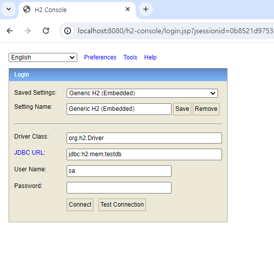
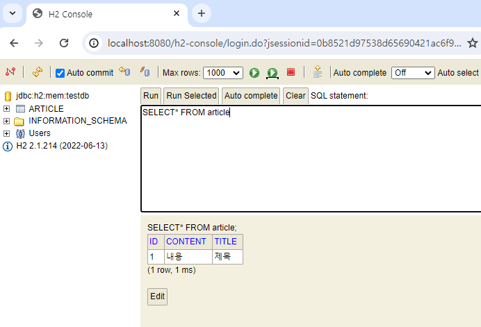

# 나만의 블로그 프로젝트
## 1일차
- 초기 설정
- 엔티티 구성하기
    - 테이블 구조
  - | 컬럼명     | 자료형          | null | 키   | 설명        |
    |---------|--------------|------|-----|-----------|
    | id      | BIGINT       | N    | 기본키 | 일련번호, 기본키 |
    | title   | VARCHAR(255) | N    |     | 게시물의 제목   
    | content | VARCHAR(255) | N    |     | 내용        |
- 리포지터리 생성
  - BlogRepository

---
## 2일차
- 블로그 글 추가 서비스
- 컨트롤러 메서드 코드 작성
  - H2 데이터베이스 저장 테스트 
  - 
  - 
- 반복 작업을 줄여줄 BlogApiControllerTest 코드 작성 
- 블로그 글 생성 API 테스트 코드 작성
   
| Given | 블로그 글 추가에 필요한 요청 객체를 만든다.                                                   |
|-------|-----------------------------------------------------------------------------|
| When    | 블로그 글 추가 API에 요청을 보낸다. 이때 요청타입은 JSON이며 given절에서 미리 만들어둔 객체를 요청 본문으로 함께 보낸다.|
| Then| 응답 코드가 201 Created 인지 확인. blog를 전체 조회해 크기가 1인지 확인하고 실제 저장된 데이터와 요청 값 비교|
